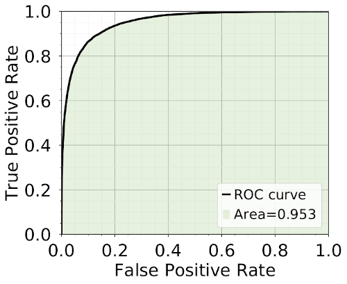

# BDT Tutorial

## General comments

After helping master's students to familiarize themselves with 
all aspects related to Boosted Decision Trees (BDTs), 
I thought it would actually be more useful to make a github project accessible to everyone.

And this is what the scripts and notebooks contained in `bdt_tutorial` are all about.
BDTs are multivariate analysis techniques utilizing machine learning algorithms.
They are employed to identify patterns and use this knowledge to predict 
outcomes for comparable, but unknown datasets.

It is recommended to setup a python environment with the required packages:
```
python3 -m venv venv
python3 -m pip install -r requirements.txt
```

The colors used throughout this tutorial were generated using the
[Color Palette Creator](https://github.com/gerauber/color_palette_creator)

This code follows the style convention established in the 
[PEP8 document](https://peps.python.org/pep-0008/).

Version 1.2.1

## Procedure

### Dataset
First, it is important to have a dataset on which we want to apply our BDT.
It is composed of two slightly different sets containing the same columns.
We merge together these sets to have our dataset, which is saved in a `.pkl` file

`create_pkl.py` allows the creation of this dataset through the use of a _Parser_. 
This Parser takes as parameter the number of rows _x_ that have to be created, 
and the name _filename_ of the output files (both dataset and plot of the features).
Therefore, the user has to execute:
```
python create_pkl.py -r x -f filename
```

##### Dataset

  

#### Remarks
* The dataset has a _weight_ column that will be useful later, as the BDT focuses 
on distributions shapes, and therefore this extra piece of information can be 
decisive in the classification.
* The rows are shuffled even though it is not necessary for this first step, 
but it will be a key feature when the BDT will be applied on another dataset.


### Basic BDT
Then, the user can start playing with several aspects surrounding BDTs.
In the notebook `bdt.ipynb`, the user can have an interactive experience.
A model will be fit on the data, and the reproducibility, as well as the BDT performance
will be evaluated.

##### ROC curve

 


##### Overfitting
 
 


##### Classifier

 

The user can then experience the application of a BDT method on another 
dataset, by using the notebook `apply_bdt.ipynb`. Here, no performance
is assessed as it is assumed that the categories are not known.

##### Dataset 2

  


##### Classifier 2

 


#### Remarks
* Jupyter notebooks can be opened by typing the command `jupyter notebook`
in the terminal, such that the program will instantiate a local server at _localhost:8888_, 
and the Jupyter Notebook interface will pop up in a browser window.
* The package `lightgbm` will have to be installed.


### Optimized BDT
In a view of giving a comprehensive set of tools related to BDTs, 
a separate folder has been added to the basic notebook provided in `basic_bdt/`.
In this case, the user can optimize the number of features, by looking at both
their correlations and their ranking, and the hyperparameters.
Here, a couple of scripts are provided to play with these notions. 
All main commands are summarized in `optimized_bdt/subscript.sh`.

First, the user can change the BDT input in `input.py`, where the inputs 
(more specifically the features and the hyperparameters) are listed in a
dictionary.

Correlations are computed by `correlations.py`, for which the user has to 
specify a dataset _filename_, a dictionary name _jsonname_ and an output name 
_outputname_, such as the user executes the following command:
```Shell
python correlations.py -f filename -j jsonname -o outputname
```

##### Correlation matrix of Category 1

 

##### Correlation matrix of Category 2
 


Ranking can be obtained in a similar manner, by using `ranking.py`. The 
options are similar to the ones detailed for the correlations, except that
the user has to speficy a method _method_ as well. Therefore, the following 
command has to be executed:
```
python ranking.py -f filename -j jsonname -o outputname -m method
```

##### Basic ranking
 

##### Advanced ranking
 

##### RFE selection
 


Finally, an optimization of the hyperparameters can be done by using `hyperparameters.py`.
The options are the same as for the ranking, such that the following command
has to be executed:
```
python hyperparameters.py -f filename -j jsonname -o outputname -m method
```

#### Remarks
* Correlations are usually computed separately for both categories, but it might be
also useful to compute the correlation for the whole dataset
* Three methods of ranking are provided, and correspond to 
	* A basic evaluation of the importance of the features ( *basic_rank* )
	* An advanced computation of features' importance, done in a pipeline, and with
	repetitions and folds ( *advanced_rank* )
	* A Recursive Feature Elimination, done in two steps ( *rfe* )
		* 1: Compute the optimal number of features, and their ROC AUC values
		* 2: Detemine which features were selected
* Three methods of hyperparameter optimization are provided, and correspond to 
	* a Bayesian ( *bayesian* ) search
		* Run `pip install bayesian-optimization` to have access to this method
	* a random ( *random* ) search
	*  a method provided by the Optuna package ( *optuna* )
		* Run `pip install optuna` to have access to this method

##### Comparison of hyperparameters
 
